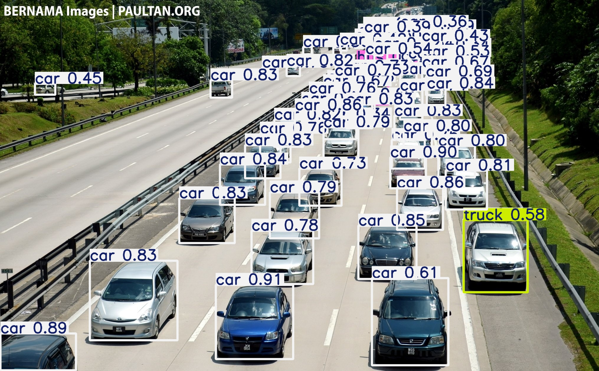
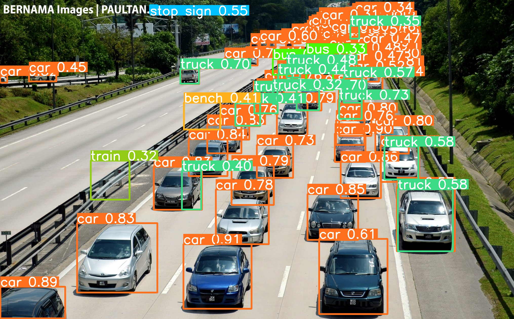
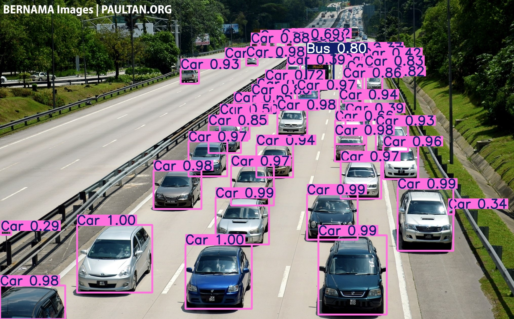
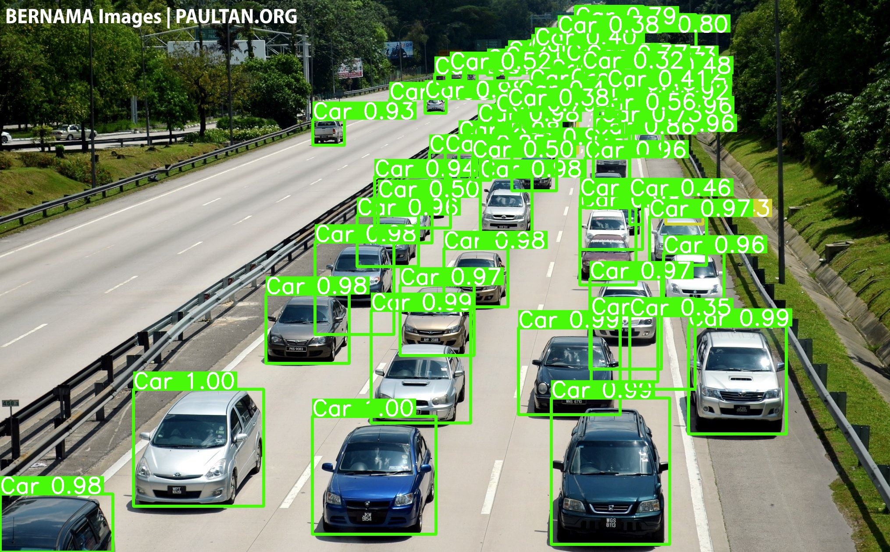

# 🚗 Comparison of YOLOv11 + SAHI Object Detection vs. YOLOv11

This project demonstrates **object detection on images** using [YOLOv11](https://github.com/ultralytics/ultralytics) combined with [SAHI](https://github.com/obss/sahi) (Slicing Aided Hyper Inference).  
SAHI improves performance on **small objects** by slicing images into smaller patches before inference.

---

## ✨ Features
- 🖼️ Detect objects in **images** with YOLOv11  
- 🔍 Better detection of **small objects** with SAHI  
- ⚡ Supports both GPU & CPU  
- 💾 Save and visualize detection results  

---

## 📂 Project Structure
```
/Detect Cars Camera
├── img/                      
│   └── img1.jpg
├── Result/                   # Detection results
│   ├── FineTuneSahi.png
│   ├── FineTune.jpg
│   ├── Yolov11_Sahi.png
│   └── Yolov11.png
├── Train model with dataset/ # Training scripts
│   └── detect/
│       ├── predict/
│       └── train/
├── vehical/                  # Dataset
│   ├── test/
│   ├── train/
│   └── valid/
├── best.pt                   # Fine-tuned YOLOv11 model
├── yolo11n.pt                # Pretrained YOLOv11 model
├── TrainSahi.py              # Script for prediction with SAHI
└── requirements.txt          # Dependencies
```

---

## ⚙️ Installation
```bash
# Clone repo
git clone https://github.com/<your-username>/yolo11-sahi-object-detection.git
cd yolo11-sahi-object-detection

# Create environment (optional)
python -m venv venv
venv\Scripts\activate   # On Windows

# Install dependencies
pip install -r requirements.txt
```

---

## 🚀 Usage

### 🔹 Predict with YOLOv11 or Fine-Tuned Model
```bash
yolo detect predict model=<your-model> source=<your-source>
```

### 🔹 Predict with YOLOv11 + SAHI
```bash
# Edit TrainSahi.py to set your model path, then run:
python TrainSahi.py
```
## Detection Results
### 🔹 YOLOv11 (Without SAHI)


### 🔹 YOLOv11 + SAHI


### 🔹 Fine-Tuned YOLOv11


### 🔹 Fine-Tuned YOLOv11 + SAHI

---

## 📊 Notes
- This project **compares YOLOv11 with and without SAHI** for small object detection.  
- Results depend on the dataset and input image quality.  
- The purpose is to highlight **SAHI as a data augmentation technique**, compared to more traditional ones like cropping, rotation, or blurring.  

---

## 📖 References
- [Ultralytics YOLO](https://github.com/ultralytics/ultralytics)  
- [SAHI (Slicing Aided Hyper Inference)](https://github.com/obss/sahi)  

---

👨‍💻 Developed by [Thang](https://github.com/<shea1108>)
